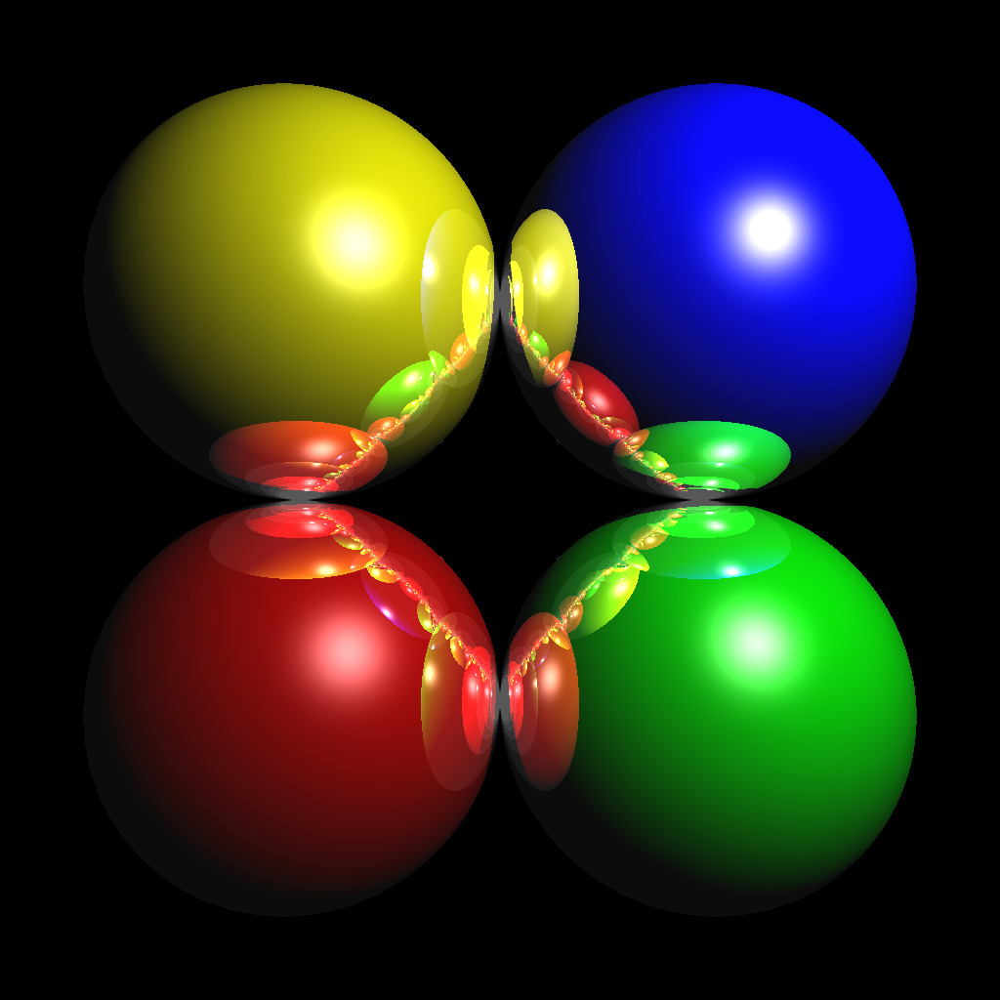
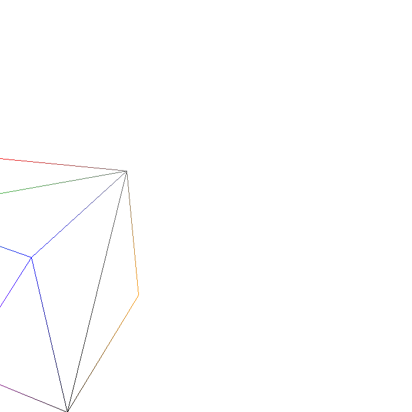
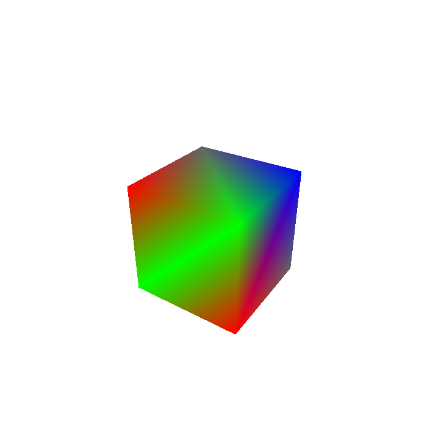
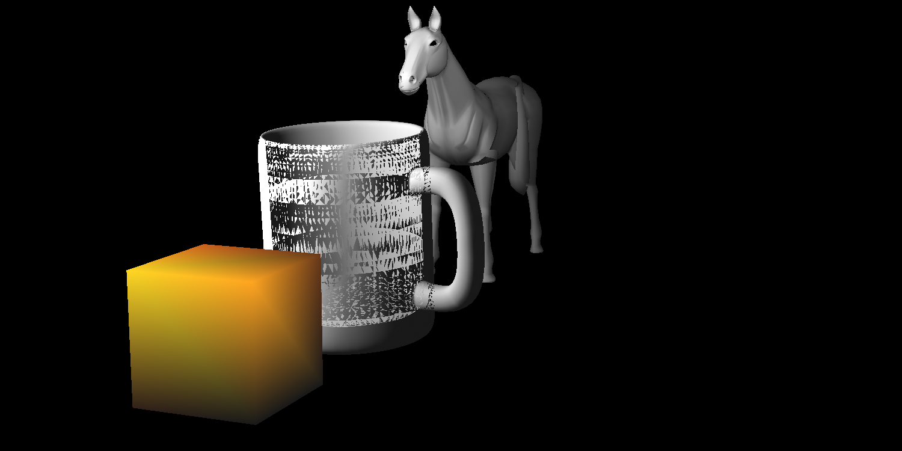
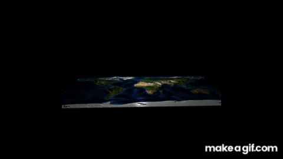
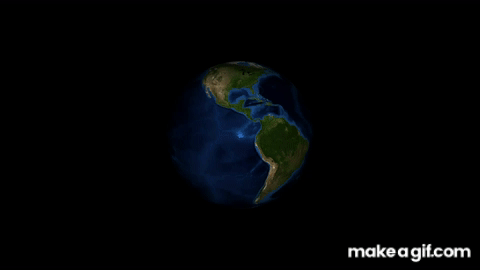

# ComputerGraphics
Implementations for various rendering algorithms and OpenGL homework within the content of Ceng477 Course, written in C++ and GLSL. Development is done on CLion using `CMake`, hence one can directly import parts separately to CLion and run them in there using `CMakeLists`. Also `Makefiles` are provided for further convenience.

## RayTracing - Backward Rendering Pipeline
Implemented a Concurrent version of Ray Tracing Algorithm using Basic Illumination Model with Phong Shading (Ambient + Diffuse + Specular) to Render Scenes such as:

## Rasterization - Forward Rendering Pipeline
Implemented all steps of Forward Rendering Pipeline until Fragment Pipeline (All kinds of transformation stuff + Clipping + Culling + Rasterization) to Render Scenes such as:

Implementation uses Backface Culling and Liang-Barsky 3D Line Clipping Algorithms for Culling and Clipping phases. Also implementation does not use a Z-Buffer and relies on the fact that, input is given back-to-front order (uses Painter's Algorithm).

## Heightmap and Texture Mapping using OpenGL with Programmable Shaders
Implemented two `OpenGL` programs to render both flat Earth model and spherical Earth model (created not only for the Earth inputs; one may also run programs with any kind of input) using vertex and fragment shaders to display a texture image as a height map to fly through the scene interactively by processing keyboard input. Via Keyboard inputs, one can interactively fly through the scene, shift textures, increase/decrease heights of locations, modify location and altitude of the light etc. Below GIFs are sections from the outputs of those programs for Earth inputs.

### Flat

### Sphere

